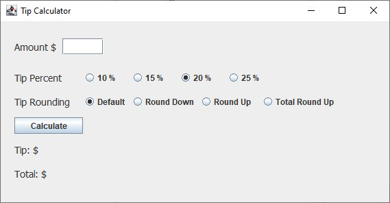
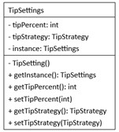
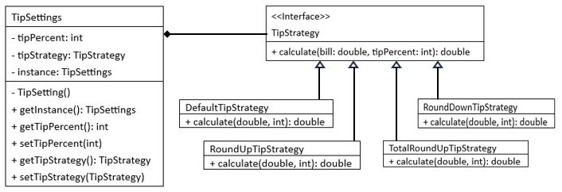

# Lab3: Tip Calculator

## Objectives

- Learn how to use and implement Singleton Design Pattern
- Learn how to use and implement Strategy Design Pattern

## Work

1. Tip Calculator calculates the tip based on the selection of tip percent and tip rounding for the amount of bill.
2. The program uses the singleton design pattern and the strategy design pattern.
3. `Lab3.java` is the main Java file which defines all the window components. You don't need to make any changes to the file.
3. `TipSetting.java` is a signleton class file. Complete the `TipSettings` class in the class file. Its class diagram is shown below.

4. `TipStrategy` is defined as an interface in `TipStrategy.java`. It is implmented in four different tip strategy classes: `TipStrategyDefault`, `TipStrategyRoundDown`, `TipStrategyRoundUp`, and `TipStrategyTotalRoundup`. 

5. The first three tip strategies are defined in their class files. Complete the fourth strategy `TipStrategyTotalRoundUp` in `TipStrategyTotalRoundUp.java`. The tip calculation is as follows:
- tip = bill * tipPercent / 100
- total = Ceiling(tip + bill)  // use Math.ceil
- finalTip = total - bill

---
End of Lab3

